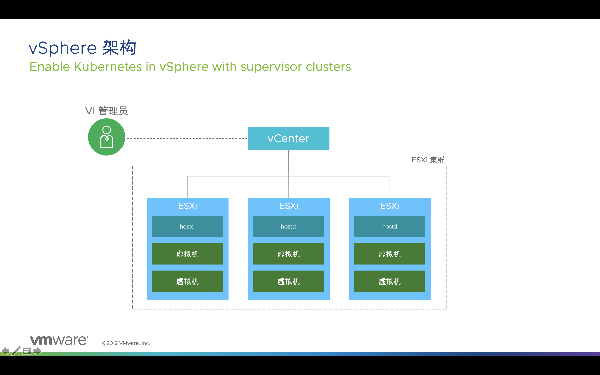
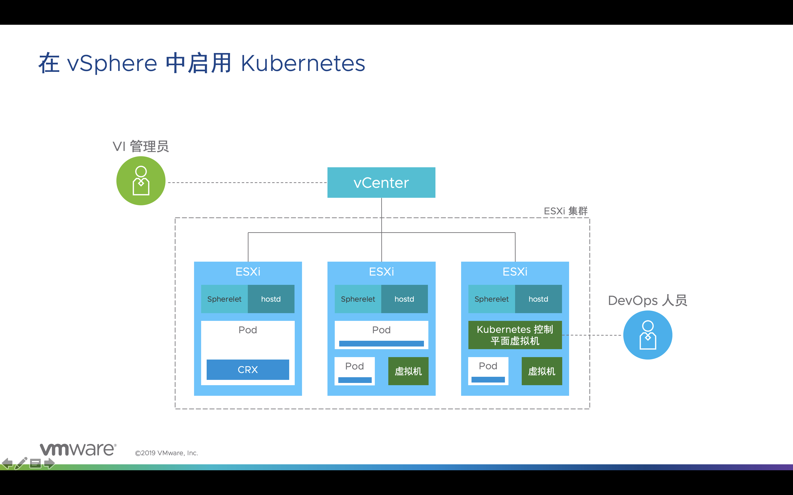
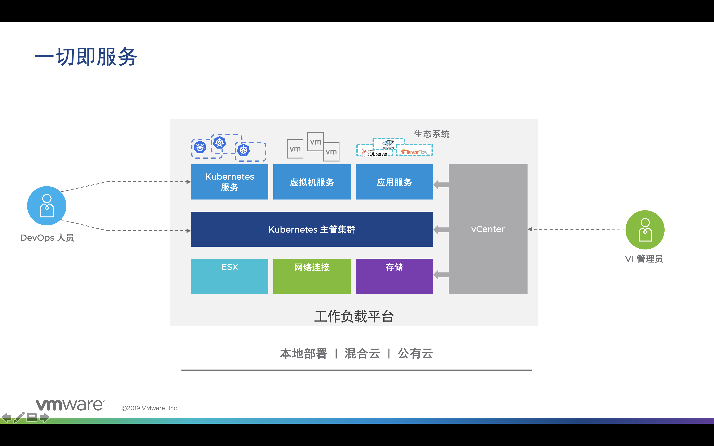
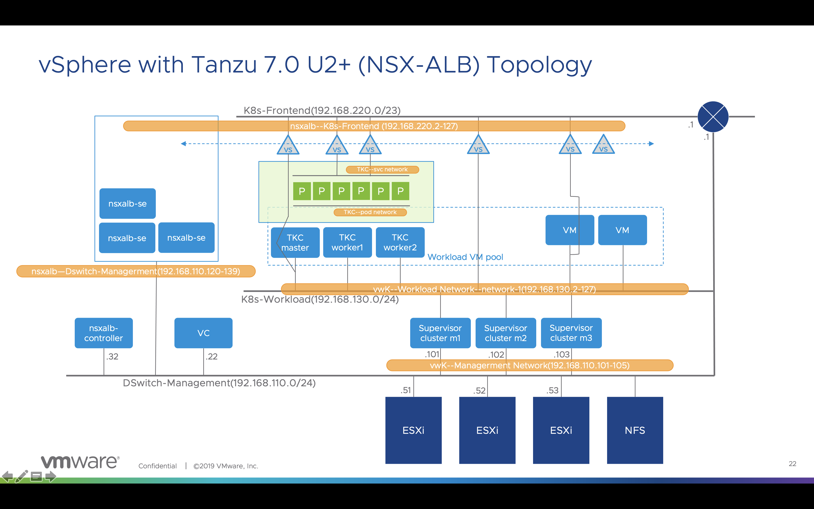
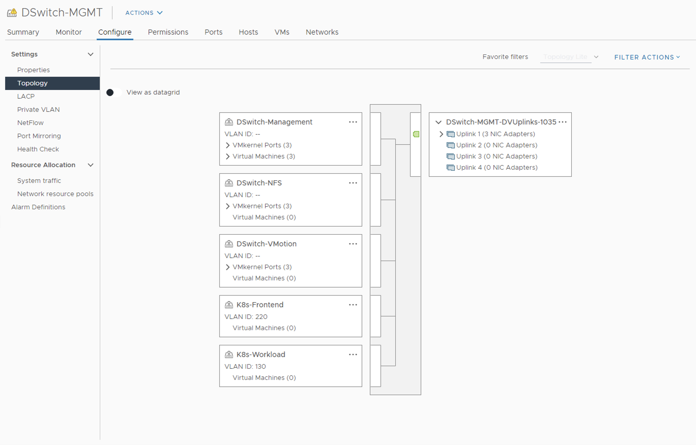

# vSphere with Tanzu实验-1：功能简介与实验环境简介

VMware vSphere是市场上非常常用的服务器虚拟化软件，许多组织已经使用之作为其IT基础架构部门的关键技术组件。

随着vSphere7开始内置Kubernetes，使得vSphere平台不但能够运行VM，同时可以支持容器业务的运行。 VMware在市场上的独特之处在于同时管理VM和容器业务，并不断致力于增强和完善这一目的。

从vSphere7.0 U2开始，利用VM operator技术，支持通过Kubernetes对VM的进行生命周期管理。这一功能增强了VM作为不可变基础设施的使用场景，实现了VM业务的声明式配置管理，使得VM场景的GitOps实现成为可能。

## vSphere with Kubernetes简介

传统的vSphere架构如下，在每一台ESXi Server内内置了hostd agent，vCenter Server通过hostd agent实现多台ESXi Server的统一管理，提供VM的生命周期管理，以及日常的监控和配置管理。

vSphere7开始，提供了vSphere with Kubernetes特性，即vSphere7内置了Kubernetes功能，其实现方式是：

- 由3台Kubernetes控制平面VM（即master node），组成高可用的Kubernetes集群控制平台；按照VM反亲和性规则自动分配在不同的ESXi Server上运行。
- 每一台ESXi Server内置Spherelet（Kubelet的ESXi版本），这样每一台ESXi Server将作为Kubernetes集群的worker node，提供容器业务的运行支持。

我们把ESXi内置的Kubernetes集群称之为主管集群Supervisor Kubernetes Cluster。

我们还可以通过创建多台VM安装任意的Kubernetes发行版，这样构建的Kubernetes集群我们称之为Guest Kubernetes Cluster。

VMware 提供VMware签名的Kubernetes发行版Tanzu Kubernetes Cluster，简称TKC。TKC是Guest Kubernetes Cluster的一种可能。TKC的最大优点是：在vSphere中，主管集群可以通过yaml文件定义TKC的参数规格，实现简单快捷的TKC生命周期管理和在线升级能力，即通过Kubernetes管理Kubernetes Cluster。 

综上所述，启用Kubernetes服务的vSphere能够实现一切即服务：

- 传统的VM服务。同时，vSphere7.0 U2开始利用VM operator技术，支持通过Kubernetes管理VM，实现了新型的VM服务。
- 直接运行在ESXi之上的vSphere Pod服务，此服务事实上是1个Pod运行在1个定制过的轻量级VM中，面向生产实现了更好的安全性。但是这个轻量级的VM无需人工管理，创建Pod时会自动加载，而且是秒级加载。所以vSphere Pod的使用体验和原生的容器使用体验完全一致。
- Tanzu Kubernetes Cluster服务。
- Guest Kubernetes Cluster之上的原生容器服务。
- 如同Kubernetes operator项目一样，也可以通过基于VM operator构建生态环境，实现VM之上的应用服务管理。

尤为重要的是，启用Kubernetes的vSphere所实现这些所有服务，都是可以通过Kubernetes实现管理的。无论是VM和TKC，还是TKC内的容器，都是可以通过yaml文件定义和部署的，实现了声明式配置。结合GitOps，这将大大改变数据中心的传统运维方式。

回顾DevOps如火如荼的这十年来，DevOps Pipeline打通了Dev和Ops的流程，但是似乎绝大部分都是成功在Dev侧。Ops侧仅仅意识到流水线所需实现的自动化部署，而没有意识到应该利用一些优秀的工程实践来改善运维的整体模式，这包括了不可变基础设施、声明式配置、通过版本控制管理基础架构配置、GitOps。

事实上，早在著名的DevOps Master教材《持续交付》的第十一章基础设施和环境管理中已经指出，运维团队应该通过敏捷技术提升Infra的管理能力。综合描述了符合DevOps理念的基础架构管理应该实现以下6个特性：

1. 基础设施的准备工作应该是**自动化过程**。
2. 使用保存于**版本控制库中的配置信息**来指定基础设施所处的状态。
3. **配置信息是声明式**的、幂等的。
4. 基础设施应该具有**自治特性**，及应该自动的将自己设置为所需状态。
5. 通过测试和监控手段，掌握基础设施的**实时状态**。
6. Infra配置信息通过版本控制管理，成为**部署流水线输入**的一部分。

这些特性和GitOps理念一致。

上图中，网络连接部分有两种选择：

- 采用vSphere分布式虚拟交换机DVS实现网络连接，外部通过NSX-ALB实现负载均衡接入，此为vSphere with Tanzu解决方案。
- 采用NSX-DC实现overlay的网络连接，外部通过NSX-DC自带的负载均衡功能接入，此为 VCF with Tanzu解决方案。

## vSphere with Tanzu实验环境简介

本次实验的网络连接采用vSphere分布式虚拟交换机DVS实现，外部通过NSX-ALB实现负载均衡接入。

实验的设计拓扑图如下：

实验中：

- 深蓝色部件为物理机实现，全部采用双万兆网卡通过物理网络实现连接；
- 浅蓝色部件为运行在3台ESXi Server中的VM实现；
- 绿色部件为运行在由多台VM构建的TKC(Tanzu Kubernetes Cluster)中的容器实现；
- 所有黑色网络都是有ESXi Server内部的分布式虚拟交换机实现；
- 橘色部分是安装配置中需要预先规划的IP地址段。

6个橘色IP地址段说明：

- vwK--Managerment Network(192.168.110.101-105)：Supervisor Kubernetes Cluster控制平面由3个master node组成，一共占用5个管理网段IP地址。其中，3个master node各占用1个IP地址，和1个虚拟IP，还有一个内部使用的IP地址，用于故障诊断。
- vwK--Workload Network--network-1(192.168.130.2-127)：Supervisor Kubernetes Cluster可以在Workload Network网络部署多个Tanzu Kubernetes Cluster（TKC，底层使用VM）和VM，这些都是自动部署，自动分配IP地址的。
- nsxalb--Dswitch-Managerment(192.168.110.120-139)：NSX-ALB是软件定义的负载均衡解决方案，采用了控制平面和转发平面分离的技术。在我们的实验中部署了1个NSX-ALB controller（nsxalb-controller）作为控制平面，转发平面NSX-ALB Service Engine（nsxalb-se）是VM的形态，由控制器自动按需部署。其IP地址在此IP地址段内自动分配。
- nsxalb--K8s-Frontend (192.168.220.2-127)：NSX-ALB为TKC中的容器service和VM service自动创建负载均衡接入服务，每个负载均衡接入服务使用的virtual service(vs)是运行在NSX-ALB Service Engine VM中的1个进程。virtual service IP地址在此地址段内自动分配。
- TKC--svc network：Tanzu Kubernetes Cluster的service地址段，可以自由选择。
- TKC--pod network：Tanzu Kubernetes Cluster的pod地址段，可以自由选择。

实际的ESXi内部的分布式虚拟交换机连接如下图所示。

