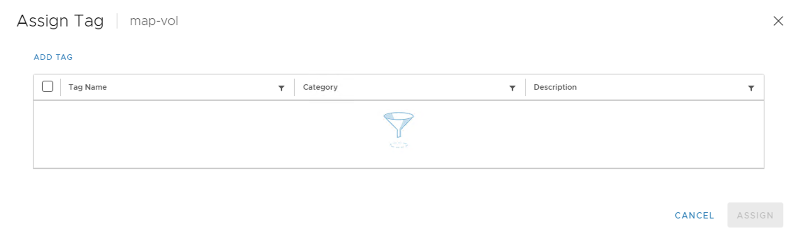
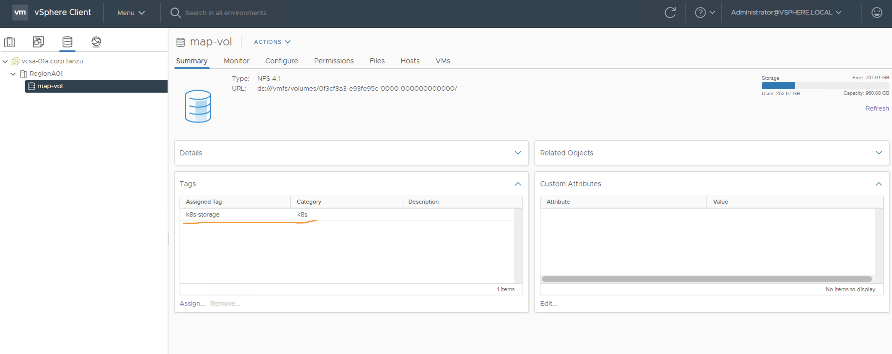
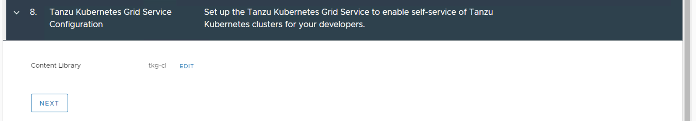

# vSphere with Tanzu实验-3：vSphere with Kubernetes服务启用与配置

本次实验的网络连接采用vSphere分布式虚拟交换机DVS实现，外部通过NSX-ALB实现负载均衡接入。

实验的设计拓扑图如下：


安装中涉及到的IP地址段说明：

- vwK--Managerment Network(192.168.110.101-105)：Supervisor Kubernetes Cluster控制平面由3个master node组成，一共占用5个管理网段IP地址。其中，3个master node个占用1个IP地址，1个虚拟IP，还有一个内部使用的IP地址，用于故障诊断。
- vwK--Workload Network--network-1(192.168.130.2-127)：Supervisor Kubernetes Cluster可以在Workload Network网络部署多个Tanzu Kubernetes Cluster（TKC，底层使用VM）和VM，这些都是自动部署，自动分配IP地址的。


## 前期准备

- 部署和配置了NSX Advanced Load Balancer。

- vSphere7.0准备条件参见： **[Workload Management](https://docs.vmware.com/en/VMware-vSphere/7.0/vmware-vsphere-with-tanzu/GUID-EE236215-DA4D-4579-8BEB-A693D1882C77.html)**。
- vCenter管理员权限的用户。


如图所示，我的环境是3台ESXi Server，共享存储使用了软件模拟的NAS，网络我们使用vSphere vDS Networking，外部负载均衡使用NSX-ALB。

启用vSphere with Kubernetes功能，实现的方式是在vSphere Cluster上安装和配置Supervisor Kubernetes Cluster。Supervisor Kubernetes Cluster和vSphere Cluster是一一对应的。


以下我们把vSphere7.0准备条件中的创建Storage Policy和Content Library部分单独描述一下。


### Storage Policy

我们计划在NAS上创建的map-vol Datastore上存放Kubernetes相关数据。

#### 创建storage的Tag

从Menu进入Storage配置页面，为map-vol Datastore定义Tag。




点击ADD TAG。


点击Create New Category。


创建k8s Tag Category。


在k8s Tag Category中创建k8s-storge Tag。

结果如下图所示。




#### 创建storage policy

从Menu进入Policies and Profiles配置界面中，进入VM Storage Policies页面，点击CREATE。


创建VM Storage Policy，名字为k8s-policy，NEXT。


在Policy structure页面，选择Enable tag based placement rules，NEXT。


在Tag Based placement页面，ADD TAG RULE，选择之前创建的k8s-storage，NEXT。


系统会在Storage compatibility页面中显示兼容的Datastore，NEXT。


检查配置，FINISH。


后续启用vSphere with Kubernetes的配置中，会使用此storage policy，vSphere with Kubernetes会自动把它翻译成Kubernetes的storage class。


### Content library

#### 创建TKG的Content Library

从Menu进入Content Libraries配置界面中，点击Create。


创建Content Library，名字为tag-cl，NEXT。


Configure content library页面中，选择如下图所示，NEXT。

VMware会根据Kubernetes社区的版本发展不断更新TKC的版本，并把它们放在图中所示网站上，方便访问和订阅。当然此时要求vSphere环境能够连接Internet。

否则，就需要手工下载和导入此content library。


定义此content library使用的存储设备，NEXT。


检查配置，FINISH。


#### 创建VM Service的Content Library

前面已经提到vSphere 7.0 U2之后开始支持通过Kubernetes创建和管理VM。此服务称为Kubernetes VM Service。

启用此功能，需要创建Kubernetes VM Service使用的Content Library，用来存放VM的OS基础镜像。Supervisor Kubernetes Cluster将会基于这个Content Library中存放的VM的OS基础镜像和cloud-init配置实现VM业务的交付。


创建Content Library，名字为vmservice-cl，NEXT。


选择Local content library，NEXT。

目前VMware提供CentOS和Ubuntu基础镜像，但是还不能通过订阅方式自动下载，所以还需要手工下载和导入。


选择存储设备，NEXT。


检查配置，FINISH。


最终两个Content Library的配置结果如下。


## 启动Workload Management

即是在一个vSphere Cluster上安装和配置Supervisor Kubernetes Cluster。

从Menu进入Workload Management配置页面，点击GET STRATED。


选择vCenter Server Network，即是选择vDS Networking，NEXT。


选择安装的vSphere Cluster，NEXT。


根据需要选择Supervisor Kubernetes Cluster的3台Master Node VM的规格尺寸，NEXT。


选择存放Supervisor Kubernetes Cluster的3台Master Node的storage policy，NEXT。


配置外部网络向Supervisor Kubernetes Cluster内部网络访问的负载均衡方案。此处，我们使用NSX Advanced Load Balancer（即Avi）作为负载均衡方案。

Type=Avi。

Avi Controller IP=nsxalb-controller-01a.corp.tanzu:443。

> 此处注意不要使用IP地址，因为我们在相应的CA证书中设置SAN为nsxalb-controller-01a.corp.tanzu，此时不支持IP地址。

User name=admin。

Password=xxxx。

Server Certificate Authority的配置由NSX-ALB的配置获取。

>  登录NSX-ALB管理界面， **Templates -> Security –> SSL/TLS Certificates**。选择之前设置的证书nsxalb-controller-01a.corp.tanzu，点击编辑，拷贝**Certificate** 中的内容，粘贴到Server Certificate Authority中。
>
> 

NEXT。


指定相应的Supervisor Kubernetes Cluster的3台Master Node VM管理网络配置，NEXT。


指定连接Supervisor Kubernetes Cluster的3台Master Node VM和未来Kubernetes VM Service部署的VM的Workload Network配置。


点击ADD，配置Workload Network的IP地址段，SAVE。


回到上一页面，NEXT。


指定TKG的Content Library，NEXT。




检查配置，FINISH。


## 验证

经过一段时间的安装配置，成功的结果如下图所示，显示此vSphere Cluster上的Supervisor Kubernetes Cluster运行状态为Running，控制平台的外部访问IP为192.168.220.2。


在NSX-ALB 管理界面中，NSX-ALB controller自动为Supervisor Kubernetes Cluster的3台Master Node VM（192.168.130.8，192.168.130.9，192.168.130.10）自动创建了Virtual Service，实现了6443和443端口的负载均衡接入服务。


## 第一次使用

### 创建namespace

从Menu进入Workload Management配置页面，点击NEW NAMESPACE


创建namespace，名字为tkg，CREATE。


在Permissions配置中，可以为namespace 添加用户。用户权限分为3类：Can view，Can edit，Owner。

在Storage配置中，可以为namespace 指定存放PVC的storage policy。

在Capacity and Usage配置中，可以为namespace 指定resource limit。


### 下载安装Kubectl和vSphere插件

访问Https://192.168.220.2


根据自己的OS类型，选择SELECT OPERATING SYSTEM=LINUX/Windows/Mac OS。

DOWNLOAD CLI PLUGIN。

解压后有两个文件：kubectl和kubectl-vsphere，添加可执行权限。

按照页面的提示，将这两个文件拷贝至OS可以自动寻址的目录下即可。


### 登陆Supervisor Kubernetes Cluster

```
$ kubectl vsphere login --server 192.168.220.2 -u administrator@vsphere.local --insecure-skip-tls-verify
Password：xxxx

Logged in successfully.

You have access to the following contexts:
   192.168.220.2
   tkg

If the context you wish to use is not in this list, you may need to try
logging in again later, or contact your cluster administrator.

To change context, use `kubectl config use-context <workload name>`

$ kubectl config current-context 
192.168.220.2

$ kubectl get all
NAME                 TYPE        CLUSTER-IP   EXTERNAL-IP   PORT(S)   AGE
service/kubernetes   ClusterIP   10.96.0.1    <none>        443/TCP   245d 

```

登陆成功后，会自动创建两个context，

`kubectl config use-context 192.168.220.2`，进入Supervisor Kubernetes Cluster的default namespace。

`kubectl config use-context tkg`，进入Supervisor Kubernetes Cluster的tkg namespace。

之后即可进行正常的`kubectl`命令操作了！


